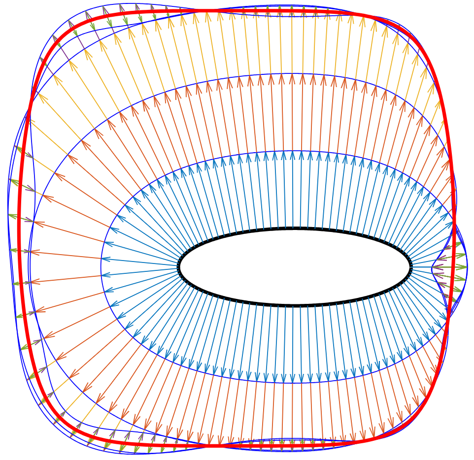

# Shape Optimisation for Two-Dimensional Level Set Functions

**Author:** Mike Fuller

**Last Updated:** 28th July 2025

This repository contains the code snippets and figures I used to put together my 2018 Rokos Internship research report on shape optimisation. All code snippets were written in $\text{MATLAB}$ and leveraged the [`chebfun`](https://www.chebfun.org/) package, allowing ease of parametrisation and visualisation of the level set functions used throughout.

- [MATLAB code snippets](https://github.com/itsmikefuller/shape_optimisation/tree/main/code)
- [Figures (mostly in EPS format)](https://github.com/itsmikefuller/shape_optimisation/tree/main/figures)
- [Final PDF Report](https://github.com/itsmikefuller/shape_optimisation/blob/main/report/report.pdf)